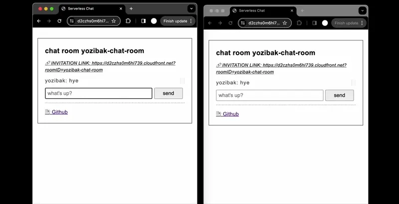
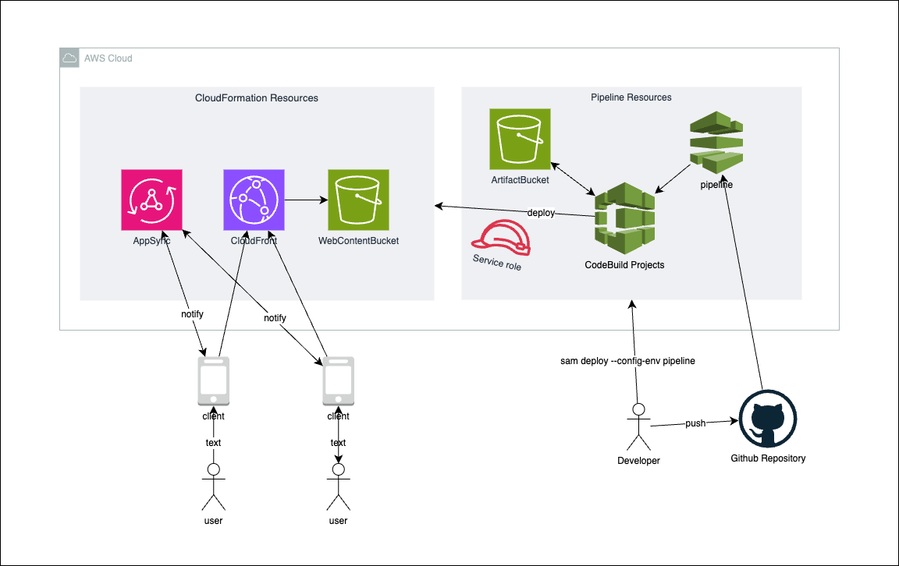

# 💬 serverless-chat 

**A fullstack AWS serverless application (SAM) example**

- frontend: React chat application
- backend: AWS Appsync
- CICD: Github connection + CodePipeline

## Play



production envrionment: https://d2czhs0m6hl739.cloudfront.net/

1. Open the link
2. Enter username and open the invitation link in another browser
3. Send messages

\* It doesn't save any message data. They're alive only while you have the open.

## Design



### Backend

- AppSync to receive messages and forward the data so that the subscribers can be notified ([real time data](https://docs.aws.amazon.com/appsync/latest/devguide/aws-appsync-real-time-data.html))
- Mutation `SendMessage` uses `forwardMessage` as [unit resolver](https://docs.aws.amazon.com/appsync/latest/devguide/resolver-components.html)
- API deployed through `AWS::AppSync::GraphQLApi`

### Frontend

- React application with GraphQL endpoint
- Every time it receives subscription result, it updates the state
- Files are hosted on a S3 bucket, which is accessed via CloudFront

### CICD

- CodePipeline with 2 stages (Test, Prod)
- It automatically fetches Github source on every push, then build the source and deploy backend and frontend. 
- Testing environment is intended for E2E tests & manual check
    - (You can optionally add manual approval before the production)

\* Pipeline configurations basically owe to bootstrap made by `sam pipeline --bootstrap`, I just altered it to make it fit my use case.

## Development

```sh
# Install deps
pnpm i

# Deploy backend resources to dev environment
pnpm deploy:dev # -> prints API endpoint url

# Create .env
cd frontend/app
cp .env.default .env # <- write API endpoint url & key

# Run frontend
pnpm dev

```

Optionally, you can deploy frontend build onto your dev S3 bucket

```sh
sh deploy_frontend.sh dev
```

## Deployment

You can basically deploy to your AWS environment by selecting `test` or `prod` as `sam deploy --config-env` just as same as `dev` environment.

To setup CICD, follow steps below. 

### Prerequisite: Create Github Connection

Go to AWS console -> Pipeline -> Settings -> Create connection

Select your repository & create connection. Copy the connection ARN. 

### Deploy Pipeline and other resources

Once Github connection is created, deploy pipeline by running:

```sh
sam deploy 
    \--config-env pipeline 
    \--parameter-overrides ConnectionArn=GITHUB_CONN_ARN,FullRepositoryId=<username>/<repository_name>
```
